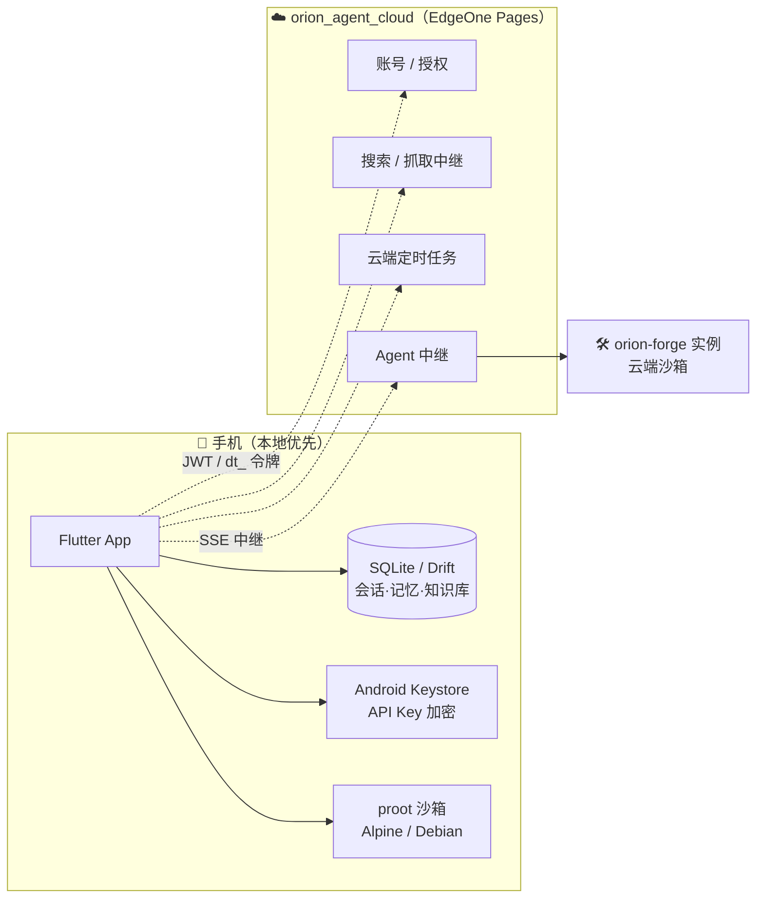

<div align="center">

# 🛰️ Orion Agent

**运行在 Android 手机上的个人 AI 助手 —— 能聊天，也能干活。**

内置 Linux 终端 · 本地知识库 · MCP 工具扩展 · 云端 Agent
数据全部留在本机，离线可用。

[](https://flutter.dev)
[](https://www.android.com)
[](../../actions)
[](../../releases)
[](#-许可)

</div>

> **当前状态**：功能完整可用，侧载分发（不上架应用商店）。Android arm64 only。
>
> ⚠️ **从旧版（pocket_agent）升级说明**：本项目已更名为 orion_agent，数据库文件名同步改为
> `orion_agent.sqlite`，**不做迁移**——旧版用户升级后会看到空库（数据文件仍在），
> 需重新配置模型服务与知识库；全新安装不受影响。
> 仓库已从 `suanx/pocket-agent` 迁至 **`suanx/orion_agent`**（旧仓库已删除，提交历史完整保留）。

---

## 📑 目录

- [功能总览](#-功能总览)
- [系统架构](#-系统架构)
- [云功能](#-云功能账号--中继--云端任务)
- [隐私](#-隐私)
- [快速开始](#-快速开始)
- [构建](#-构建)
- [项目结构](#-项目结构)
- [待修复](#-待修复)
- [后续规划](#-后续规划)
- [技术栈](#-技术栈)

---

## ✨ 功能总览

### 💬 对话

| 能力 | 说明 |
|---|---|
| **多模型服务** | 任意 OpenAI 兼容接口（OpenAI / GLM / DeepSeek / Ollama / 硅基流动 等），可配置多个并随时切换 |
| **SSE 流式输出** | 逐字显示，支持 Markdown 渲染 |
| **多对话并行** | 多个对话可同时生成、互不干扰；停止只停自己，状态按会话隔离 |
| **多模态** | 聊天时可发送图片 |
| **文件上传** | 任意格式（zip / apk / pdf / 办公文档 / 代码等，上限 200MB）：小文本并入消息，其余交给内置 proot 终端处理 |
| **上下文管理** | 自动压缩长会话；上下文长度与最大输出可在模型配置里调（拉取模型列表时自动填充网关元数据） |
| **设备切换** | 顶栏一键切「我的手机 / 云端 Agent」——云端 Agent 在独立会话页运行，入口不与本地模型混淆 |

### 🤖 Agent 能力

- **ReAct 工具循环**——推理 → 调工具 → 看结果 → 继续推理，**轮数无上限**
  （护栏：同一工具同参数连续 3 次自动中止 + 随时点「停止」）
- **7 个内置工具**：

  | 工具 | 作用 |
  |---|---|
  | 联网搜索 | DuckDuckGo，无需 API Key |
  | 网页抓取 | 提取网页正文 |
  | 精确计算器 | 支持括号、取余、幂运算 |
  | 当前时间 | 含时区信息 |
  | 长期记忆 | 记住你的偏好，跨对话生效 |
  | 知识库检索 | 语义搜索你导入的资料 |
  | **终端命令** | 在手机里跑真实 shell |

- **内置 Linux 环境**——通过 proot 运行 Alpine 3.22 / Debian 12，可安装
  nodejs、python3、git、uv 等；已配置国内镜像（清华源、npmmirror）
- **应用内交互式终端**——通过 SSH 连到沙箱内 sshd，支持持续会话
  （cd / top / 连续输入），沙箱未装 openssh 时自动安装并拉起

### ☁️ 云端 Agent（v0.2.43 新增入口）

- 登录云端账号后，顶栏切到「云端 Agent」即进入独立会话页
- Agent 运行在**你自己的云端实例**（沙箱里写代码、跑命令、起 dev server）
- **沙箱产物页**——查看 Agent 改过的文件树、单文件内容、一键打开 dev server 预览
- 会话与本地对话共用同一套界面与历史管理，体验零割裂

### 📚 知识库（RAG）

- 导入文档后自动分块 + 向量化，检索时按语义召回
- 回答中标注来源（`【资料N｜来源: 文档名】`），可溯源
- ⚠️ 当前仅支持粘贴文本，暂不支持 PDF/Word 导入（见[待修复](#-待修复)）

### 🎯 技能与角色

- **18 个内置技能**，覆盖写作办公、信息检索、生活助手、开发者工具四类
- 聊天框输入 `/技能名 参数` 即可调用，例如 `/写周报 本周做了A、B、C`
- 可自建技能（提示词模板）；**角色**可设定人格注入 system prompt

### 🎙️ 语音

- **Edge TTS**（微软在线音色，免鉴权）——7 个中文音色，语速/音量可调
- **系统 TTS** 兜底——Edge 失败时自动切换
- **语音输入**——说话转文字

### 🔔 通知与其他

- 回答完成、任务结束时提醒；点击通知直接跳回对话页（独立通知渠道，Android 8+ 不响铃）
- **MCP 扩展**——Streamable HTTP 接入外部工具，添加 / 编辑 / 启停
- **备份与恢复**——供应商（含 API Key）/ 聊天历史 / MCP / 设置四类数据域按开关选择，导出 / 导入 JSON；登录云端账号后支持**加密云备份与多端同步**（端上 AES-GCM，服务端零知识）
- **应用内更新**——新版本弹窗下载：进度条 + 实时速度，下载完自动拉起安装器
- **诊断日志**——运行事件与错误自动落盘，可查看、复制、导出
- **6 套配色主题** + 跟随系统/浅色/深色；存储管理；多会话管理
- **Beta 通道**——关于页可加入 Beta 测试，提前体验预发布版本

---

## 🏗️ 系统架构



**设计原则**：端上本地优先、可完全离线；云端只负责单机做不到的事。
未登录 / 未激活只是云功能置灰，本地功能不受任何影响。

---

## ☁️ 云功能（账号 / 中继 / 云端任务）

云功能对接自建后端 [orion_agent_cloud](https://github.com/suanx/orion_agent_cloud)
（EdgeOne Pages + Turso），提供账号体系、授权套餐、搜索/抓取中继、云端定时任务、
MCP 云端服务与弹窗公告。

> ⚠️ **后端地址写死在 `lib/services/cloud_config.dart`**（不暴露给用户配置）。
> 更换/迁移后端部署地址时，只需修改该文件的 `CloudConfig.baseUrl` 一处，
> 所有云功能自动跟随；改完重新打包发布即可。

---

## 🔒 隐私

- 会话、消息、长期记忆、知识库**全部存本机 SQLite**，不上传
- API Key 存于 **Android Keystore**（加密）
- Edge TTS 需要联网合成语音；除此之外无任何数据外发
- 联网搜索 / 网页抓取会把**关键词 / URL** 发给对应服务（DuckDuckGo / 目标站点）

---

## 🚀 快速开始

### 1️⃣ 获取安装包

前往 [Releases](../../releases) 或 [Actions](../../actions) → 最新成功 run →
**Artifacts** → 下载 `orion-agent-apk` → 解压得到 `app-release.apk`。

> 需允许「安装未知来源应用」。

### 2️⃣ 配置模型服务

进入 **我的 → 默认模型**（或对话页底部「配置模型」）→ **AI 提供商** → 右上角「+」。

模型配置是**两级**结构：**一个提供商 = 一套接口配置 + 一组模型**，
同一家厂商的多个模型共用一份 Base URL 和 API Key。

**第一级 · 配置 tab**（填接口信息）：

| 字段 | 说明 | 示例 |
|---|---|---|
| 名称 | 自定义，显示在列表页 | 智谱 |
| Base URL | OpenAI 兼容端点 | `https://open.bigmodel.cn/api/paas/v4` |
| API Key | 服务商的密钥 | `xxxxxx` |
| 供应商类型 | 目前均为 OpenAI 兼容协议 | OpenAI |
| User-Agent | 可选，部分网关会校验 | 留空即可 |

「选项」区还有：已启用开关、完整 URL、多 Key 模式、网络代理、提示词缓存键。
表单**边改边存**（停顿 400ms 自动写入），返回即生效。

**第二级 · 模型 tab**（填模型名）：

- 点「+」手动添加，或点「拉取模型」从服务端 `/models` 批量导入
- 每个模型可设**用途**（聊天 / 向量）、**上下文长度**、**最大输出**、**温度**
- 卡片右侧「⋮」可设为默认模型或删除

> 至少要有一个**聊天模型**才能对话；只有向量模型时无法发起对话。

### 3️⃣ 开始对话

回到「对话」页直接提问。需要实时信息、精确计算或执行命令时，Agent 会自动调用工具。
对话页底部可切换**当前提供商的聊天模型**、开关**深度思考**。

### 4️⃣（可选）安装终端环境

**我的 → 终端环境** → 选 Alpine 或 Debian → 下载安装（约 100–300 MB）。

> ⚠️ 目标设备必须是 **arm64**（绝大多数真机），模拟器（x86）不支持。

### 5️⃣（可选）配置知识库

**我的 → 知识库** → 粘贴文本 → 导入并向量化。需先添加一个**向量模型**。

### 6️⃣（可选）接入 MCP / 云端

- **MCP**：**我的 → MCP 服务器** → 添加（名称 + 端点 URL）
- **云端**：**我的 → 云服务** 登录后可用云备份、云端任务与云端 Agent

---

## 🛠️ 构建

本地**无需安装 Flutter**，推送后由 GitHub Actions 自动构建。

- 工作流：`.github/workflows/build.yml`（push to main 时自动触发）
- 产物：Actions → 最新 run → Artifacts → `orion-agent-apk`（约 12 MB），
  正式 tag 同时发布到 GitHub Releases 与 R2 更新分发

平台目录（`android/`）不提交，由 CI 在构建时按当前 Flutter stable 生成，
保证平台配置与 Flutter 版本一致。

> ⚠️ **不要在 CI 里注入 Gradle 代码**。历史上曾因此连续 5 次构建失败。
> `flutter create` 模板已自带 `kotlin { compilerOptions { jvmTarget = JVM_17 } }`，
> CI 只做**校验**不做注入。详见 [docs/PROJECT.md §8](docs/PROJECT.md#8-构建与-ci)。

---

## 📁 项目结构

```
lib/
├── main.dart          入口
├── theme.dart         主题（液态玻璃设计令牌）
├── models/            数据模型
├── providers/         Riverpod 状态
├── services/          业务逻辑（LLM / Agent 编排 / 云服务 / 终端…）
└── ui/                界面（对话 / 技能 / 任务 / 我的 / 云端…）
```

详细的技术实现、架构说明、待修复问题与后续规划见 **[docs/PROJECT.md](docs/PROJECT.md)**。

---

## 🧰 待修复

| 优先级 | 项目 | 说明 |
|---|---|---|
| P0 | **知识库文件导入** | 目前只能粘贴文本，不支持 PDF/Word |
| P0 | **非 arm64 支持** | 终端环境仅 arm64，模拟器不可用 |
| P1 | 冷启动任务时序 | 终端安装中执行自启任务会失败 |
| P1 | RAG 大规模性能 | 当前暴力检索，文档上千块后变慢 |
| P1 | 会话无分页 | 启动时全量加载所有消息 |
| P1 | 对话导出 | 缺少分享功能 |

完整清单见 [docs/PROJECT.md §12](docs/PROJECT.md#12-待修复的问题)。

---

## 🗺️ 后续规划

- 知识库支持 PDF / Word / Markdown
- 流式知识库检索（多轮工具调用后重新检索）
- 对话导出与分享
- MCP 资源（resources）支持
- 本地小模型接入（隐私优先模式）

完整规划见 [docs/PROJECT.md §13](docs/PROJECT.md#13-后续可增加的功能)。

---

## 🧪 技术栈

| 项 | 选型 |
|---|---|
| 框架 | Flutter |
| 状态管理 | Riverpod |
| 本地数据库 | Drift (SQLite) |
| 网络 | Dio |
| 密钥存储 | Flutter Secure Storage |
| 语音合成 | Edge TTS (WebSocket) + flutter_tts |
| 语音识别 | speech_to_text |
| 通知 | flutter_local_notifications |
| CI/CD | GitHub Actions |

---

## 📄 许可

仅供个人学习与使用。
